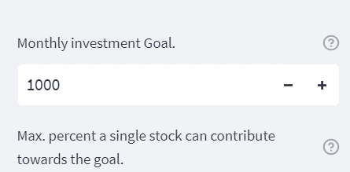
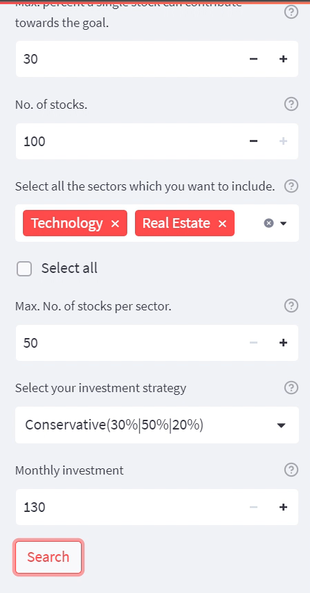
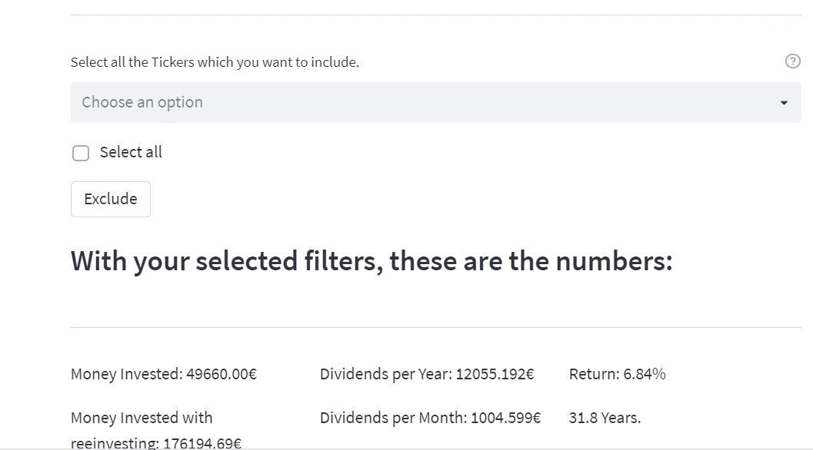

# Investolio

Investolio is a web app created with the intention of helping investors gauge different options while making long-term investments in the stock market. The purpose of this application is to guide investors when diversifying investment portfolios based on risk, dividends and estimated returns. It uses Python, its libraries, frameworks and a static database for development.

## Objective 

Stock market prices have always been uncertain and require an in-depth understanding to get good returns. Even seasoned investors can't always be sure due to the volatility of the market. Our goal with this application is to assist investors in making investment-related decisions based on the possible trends we provide.

With this web app, we also intend to help beginners learn what needs consideration before making such investments and eventually make them confident and independent.

## Methodology

1. Preprocess the data to make it easy to work with. This includes filtering outliers, duplicates, irrelevant values and unrealistic (most likely false) values.

2. Calculates minimum investment amount necessary to get returns.

3. The number of Minimum stocks required to get for each selected sector to show the selected number of recommendations.

4. Calculate investment per share and  add several columns: "Shares (Amount of Shares held for this stock), "Value of Shares (the value of the shares hold in this stock), "Total Dividends" (The number of Dividends in a month this stock makes with the 'amount of shares' it has), Contribution to Goal (% that this stocks dividends contributes towards the users' defined goal)

## Result

Input given through filters

Output received

